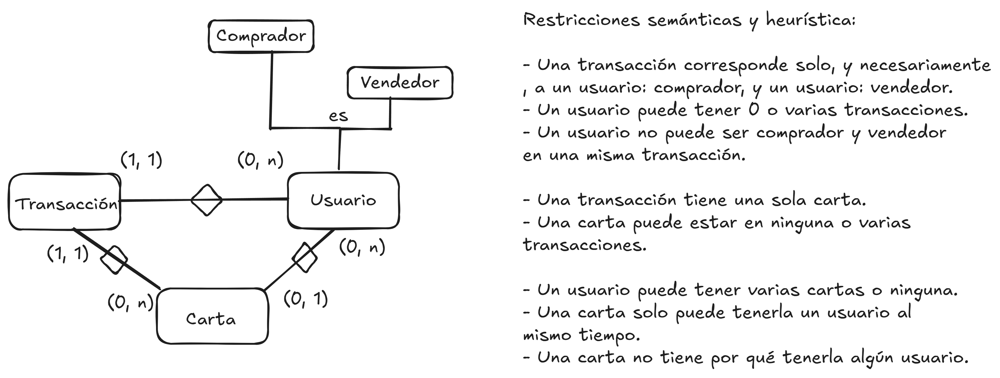
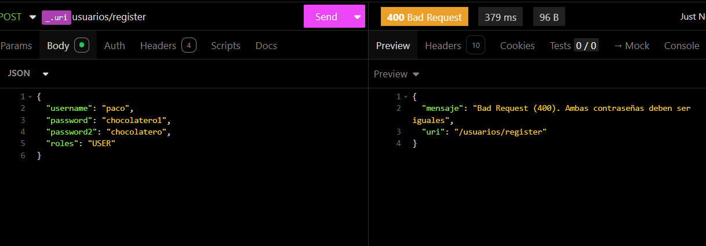
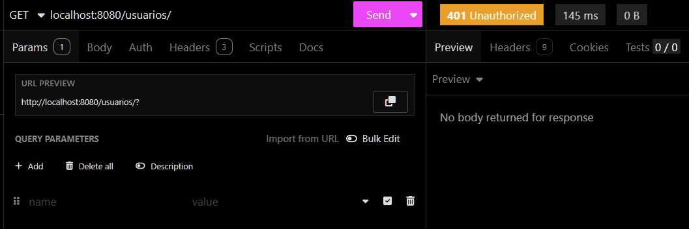

# TCG Commerce API REST

## Descripción / idea
Este proyecto trata sobre la implementación de una __API REST segura__ donde se compran y venden cartas del juego
de cartas de Pokemon:
__Trading Card Game (TCG)__.

En ella, los usuarios podrán comprar y vender cartas, sirviendo la app como página de compra.
Los administradores podrán insertar y eliminar cartas que cumplan los requisitos.

## Justificación
Esta aplicación es necesaria para que los usuarios puedan completar sus mazos con las cartas que quieran sin que adeuden
a sus padres gastando dinero en sobres, aparte, esta herramienta online sirve para la inmediatez y facilidad de obtención
de estas cartas, sin que tengan que ir a eventos presenciales una vez cada lustro.

## Tablas
Estas son las tablas que contendrá:

1. Usuarios
2. Cartas
3. Transacciones

(3) Y estas tablas contendrán los siguientes campos:

1. **Usuarios**:
    - `id` (Long): Identificador único del usuario.
    - `username`(String): Nombre del usuario (único).
    - `password` (String): Contraseña del usuario (hasheada).
    - `rol` (String): Rol del usuario, puede ser `USER` o `ADMIN`

2. **Cartas**:
    - `id` (Long): Identificador único de la carta en concreto.
    - `nombre`(String): Nombre de la carta (único).
    - `tipo`(String): Tipo de la carta.
    - `vida`(int): Puntos de vida de la carta.
    - `ataque`(int): Puntos de ataque de la carta.
    - `id_user` (Long): Identificador del usuario que tiene la carta.

3. **Transacciones**:
    - `id` (Long): Identificador único de la transacción.
    - `precio` (double): Precio de la transacción.
    - `id_vendedor`(Long): Identificador único del usuario vendedor.
    - `id_comprador`(Long): Identificador único del usuario comprador.
    - `id_carta`(Long): Identificador único de la carta.

## Diagrama Entidad-Relación

## Endpoints
1. **Autenticación**:
   - `POST /usuarios/login`: Permite al usuario autenticarse.
      - **RUTA PÚBLICA** Todas las peticiones a este endpoint deben permitirse.
      - **Entrada**: JSON con `nombre` y `password`.
      - **Salida**: Token de la sesión si las credenciales son válidas.

2. **Registro**:
   - `POST /usuarios/register`: Permite al usuario registrarse.
      - **RUTA PÚBLICA** Todas las peticiones a este endpoint deben permitirse.
      - **Entrada**: JSON con `nombre`, `password` y `roles`.
      - **Salida**: JSON con el usuario registrado.

3. **Gestión de Usuario**:
   - `GET /usuarios/`: Obtener los datos de todos los usuarios.
      - **RUTA PROTEGIDA** Sólo los usuarios autenticados como ADMIN pueden acceder a este recurso.
      - **Entrada**: Uri
      - **Salida**: JSON con los datos de los usuarios.
   - `GET /usuarios/{id}`: Permite consultar la información de un usuario por su id.
      - **RUTA PROTEGIDA** Sólo los usuarios autenticados como ADMIN pueden acceder a este recurso.
      - **Entrada**: Path variable con el id del usuario.
      - **Salida**: JSON con el usuario consultado.
   - `GET /usuarios/byNombre/{nombre}`: Permite al usuario consultar su información.
      - **RUTA PROTEGIDA** Sólo los usuarios autenticados pueden acceder a este recurso.
      - Usuarios con rol ADMIN pueden acceder a este recurso.
      - Usuarios con el mismo nombre que el que se consulta pueden acceder a este recurso.
      - Usuarios con rol USER con nombre diferente a este recurso *NO* pueden acceder al mismo.
      - **Entrada**: Path variable con el nombre del usuario.
      - **Salida**: JSON con el usuario consultado.
   - `PUT /usuarios/{nombre}`: Permite actualizar la información de un usuario.
     - **RUTA PROTEGIDA** Sólo los usuarios autenticados pueden acceder a este recurso.
     - Usuarios con rol ADMIN pueden acceder a este recurso.
     - Usuarios con el mismo nombre que el que se consulta pueden acceder a este recurso.
     - Usuarios con rol USER con nombre diferente a este recurso *NO* pueden acceder al mismo.
     - **Entrada**: Path variable del nombre del usuario y JSON con los nuevos datos del usuario.
     - **Salida**: JSON con los datos actualizados del usuario.
   - `DELETE /usuarios/{nombre}`: Permite eliminar un usuario.
     - **RUTA PROTEGIDA** Sólo los usuarios autenticados pueden acceder a este recurso.
     - Usuarios con rol ADMIN pueden acceder a este recurso.
     - Usuarios con el mismo nombre que el que se consulta pueden acceder a este recurso.
     - Usuarios con rol USER con nombre diferente a este recurso *NO* pueden acceder al mismo.
     - **Entrada**: Path variable del nombre del usuario.
     - **Salida**: JSON con los datos del usuario eliminado.

4. **Gestión de Cartas**:
   - **RUTAS PROTEGIDAS** Todas las rutas requieren que el usuario esté autenticado para acceder a las mismas.
   - `GET /cartas/`: Obtener los datos de todas las cartas.
       - **RUTA PROTEGIDA** Sólo los usuarios autenticados como ADMIN pueden acceder a este recurso.
       - **Entrada**: Uri
       - **Salida**: JSON con los datos de las cartas.
   - `GET /cartas/{id}`: Devuelve la información de una carta.
      - **SOLO ADMIN**: Solo los usuarios ADMIN pueden acceder a este recurso.
      - **Entrada**: Path variable con el ID de la carta.
      - **Salida**: JSON con `nombre`, `tipo`, `vida`, `ataque` y `id_user`.
   - `GET /cartas/byNombre/{nombre}`: Devuelve la información de una carta.
      - **Entrada**: Path variable con el nombre de la carta.
      - **Salida**: JSON con `nombre`, `tipo`, `vida`, `ataque` y `id_user`.
   - `POST /cartas`: Permite insertar una nueva carta.
      - *SOLO ADMIN*: Sólo los usuarios con ROL ADMIN pueden acceder a este recurso.
      - **Entrada**: JSON con `nombre`, `tipo`, `vida` y `ataque`.
      - **Salida**: JSON con la información de la carta insertada.
   - `PUT /cartas/{id}`: Permite actualizar la información de una carta.
       - *SOLO ADMIN*: Sólo los usuarios con ROL ADMIN pueden acceder a este recurso.
       - **Entrada**: Path variable con el id de la carta a actualizar y JSON con los nuevos datos.
       - **Salida**: JSON con la información de la carta actualizada.
   - `DELETE /cartas/{id}`: Permite eliminar una carta.
       - *SOLO ADMIN*: Sólo los usuarios con ROL ADMIN pueden acceder a este recurso.
       - **Entrada**: Path variable con el id de la carta a eliminar.
       - **Salida**: JSON con la información de la carta eliminada.
      - *SOLO ADMIN*: Sólo los usuarios con ROL ADMIN pueden acceder a este recurso.

5. **Gestión de Transacciones**:
   - **RUTAS PROTEGIDAS** Todas las rutas requieren que el usuario esté autenticado para acceder a las mismas.
   - Usuarios con rol ADMIN pueden acceder a este recurso.
   - `GET /transacciones/{id}`: Devuelve la información de una transacción.
     - *SOLO ADMIN*: Sólo los usuarios con ROL ADMIN pueden acceder a este recurso.
     - **Entrada**: Path variable con el ID de la transacción.
     - **Salida**: JSON con `id`, `precio`, `id_vendedor`, `id_comprador` y `id_carta`.
   - `POST /transacciones/`: Generar nueva transacción.
     - *SOLO ADMIN*: Sólo los usuarios con ROL ADMIN pueden acceder a este recurso.
     - **Entrada**: JSON con `id`, `precio`, `id_vendedor`, `id_comprador` y `id_carta`.
     - **Salida**: JSON con `id`, `precio`, `id_vendedor`, `id_comprador` y `id_carta`.
   - `PUT /transacciones/{id}`: Permite actualizar la información de una transacción.
     - *SOLO ADMIN*: Sólo los usuarios con ROL ADMIN pueden acceder a este recurso.
     - **Entrada**: Path variable id.
     - **Salida**: JSON con `id`, `precio`, `id_vendedor`, `id_comprador` y `id_carta`.
   - `DELETE /transacciones/{id}`: Permite eliminar una transacción.
     - *SOLO ADMIN*: Sólo los usuarios con ROL ADMIN pueden acceder a este recurso.
     - **Entrada**: Path variable id.
     - **Salida**: JSON con `id`, `precio`, `id_vendedor`, `id_comprador` y `id_carta`.
   

## Lógica de negocio
1. **Usuarios**
   - `id` autoincremental.
   - `username` único e imprescindible (not null).
   - `password` >=6 carácteres. Comprobar que coindicen password en el login con la almacenada en la bd
                y al registro: las dos password.
   - `roles` USER o ADMIN.
   - `cartas` que existan en la base de datos.

2. **Cartas**
   - `id` adjudicado (no autoincremental) (que no haya otra carta en la BD con el mismo id).
   - `nombre` único e imprescindible (not null).
   - `tipo` que sea uno de estos: `FUEGO`, `AGUA`, `PLANTA`, `RAYO`, `PSIQUICO`, `LUCHA`, `OSCURO`, `DRAGON`, `METALICO`, `INCOLORO`.
   - `vida` entre 10 y 300.
   - `ataque` entre 10 y 300.
   - `usuario` que exista en la base de datos.

3. **Transacciones**
   - `id` autoincremental.
   - `precio` mayor que 0.
   - `vendedor` que esté en la base de datos. No puede ser el mismo que el comprador.
   - `comprador` que esté en la base de datos. No puede ser el mismo que el vendedor.
   - `carta` que esté en la base de datos.

## Excepciones
1. `400 Bad Request`: Cuando un usuario forme mal una petición, como un error de sintaxis o de lo que se espera recibir.
2. `401 Unathorized`:Cuando intente acceder a endpoints donde es necesario que se esté logueado.
3. `403 Forbidden`: Cuando un usuario intente acceder a un endpoint que no le corresponde, por rol o usuario.
    - La lanzaré cuando intente acceder a endpoints solo donde puede acceder usuarios con rol ADMIN o usuarios propios de ese endpoint.
4. `404 Not Found`: Cuando intente ir a endpoints que no existen en la base de datos porque hayan sido borrados o haya habido un cambio en la URI.
4. `409 Duplicate`: Cuando se intente un registro de usuario con un username que ya existe, por ejemplo.
5. `500 Internal Server Error`: Como error general que no sea ninguno de los anteriores.

## Seguridad
1. **Autenticación mediante JWT**
    - Se utiliza **JWT (JSON Web Token)** para la autenticación de usuarios.
    - Los usuarios deben autenticarse a través del endpoint `POST /usuarios/login`, enviando su nombre y contraseña.
    - Si las credenciales son correctas, el servidor devuelve un token JWT que el cliente deberá incluir en cada petición protegida.
    - Los tokens tienen una expiración definida para mejorar la seguridad.

2. **Acceso a endpoints**
   - Todos los endpoints protegidos requieren un **token JWT válido** para su acceso.
   - Se realiza control de acceso basado en **roles** (`USER`, `ADMIN`) y **propiedad de los datos** (los usuarios solo pueden ver/editar su propia información, salvo que sean administradores).  

3. **Cifrado de contraseñas**
   - Las contraseñas se almacenan utilizando **hashing seguro**.
   - En el registro y autenticación, se compara la contraseña ingresada con el hash almacenado en la base de datos.

4. **Validaciones de seguridad**
   - Se impide el registro de usuarios con nombres duplicados.
   - Se valida que las contraseñas cumplan con requisitos mínimos de seguridad (mínimo 6 caracteres).
   - Se impide que un usuario **compre sus propias cartas**, evitando fraudes en transacciones.
   - Se verifica que los vendedores y compradores existan en la base de datos antes de procesar transacciones.
   - Ver más en cada endpoint, en la parte de **seguridad**.

## **Pruebas de Endpoints**

### **Autenticación**
- **POST /usuarios/login**
    - ✅ Prueba con credenciales correctas.
    - ❌ Prueba con credenciales incorrectas.
    - ⚠️ Prueba con un usuario inexistente.
    - ⏳ Prueba con múltiples intentos fallidos para detectar bloqueo de IP o usuario.

- **POST /usuarios/register**
    - ✅ Prueba con datos válidos.
    - ❌ Prueba con username ya existente.
    - ❌ Prueba con password de menos de 6 caracteres.
    - ❌ Prueba con password1 y password2 diferentes.
    - ❌ Prueba con un rol no permitido.

### **Gestión de Usuarios**
- **GET /usuarios/** (Solo ADMIN)
    - ✅ Prueba con usuario ADMIN.
    - ❌ Prueba con usuario USER.
    - ❌ Prueba sin autenticación.

- **GET /usuarios/{id}** (Solo ADMIN)
    - ✅ Prueba con usuario ADMIN.
    - ❌ Prueba con usuario USER.
    - ❌ Prueba sin autenticación.
    - ⚠️ Prueba con un ID de usuario inexistente.

- **GET /usuarios/byNombre/{nombre}**
    - ✅ Prueba con usuario ADMIN.
    - ✅ Prueba con usuario dueño de la cuenta.
    - ❌ Prueba con usuario USER que intenta ver otra cuenta.
    - ❌ Prueba sin autenticación.

- **PUT /usuarios/{nombre}**
    - ✅ Prueba con usuario ADMIN.
    - ✅ Prueba con usuario dueño de la cuenta.
    - ❌ Prueba con usuario USER intentando modificar otra cuenta.
    - ❌ Prueba sin autenticación.
    - ❌ Prueba con un nombre de usuario inexistente.

- **DELETE /usuarios/{nombre}**
    - ✅ Prueba con usuario ADMIN.
    - ✅ Prueba con usuario dueño de la cuenta.
    - ❌ Prueba con usuario USER intentando eliminar otra cuenta.
    - ❌ Prueba sin autenticación.
    - ❌ Prueba con un nombre de usuario inexistente.

### **Gestión de Cartas**
- **GET /cartas/** (Solo ADMIN)
    - ✅ Prueba con usuario ADMIN.
    - ❌ Prueba con usuario USER.
    - ❌ Prueba sin autenticación.

- **GET /cartas/{id}** (Solo ADMIN)
    - ✅ Prueba con usuario ADMIN.
    - ❌ Prueba con usuario USER.
    - ❌ Prueba sin autenticación.
    - ❌ Prueba con un ID de carta inexistente.

- **POST /cartas** (Solo ADMIN)
    - ✅ Prueba con usuario ADMIN.
    - ❌ Prueba con usuario USER.
    - ❌ Prueba sin autenticación.
    - ❌ Prueba con nombre duplicado.
    - ❌ Prueba con un tipo no permitido.
    - ❌ Prueba con vida o ataque fuera del rango permitido.

- **PUT /cartas/{id}** (Solo ADMIN)
    - ✅ Prueba con usuario ADMIN.
    - ❌ Prueba con usuario USER.
    - ❌ Prueba sin autenticación.
    - ❌ Prueba con ID inexistente.
    - ❌ Prueba con datos inválidos.

- **DELETE /cartas/{id}** (Solo ADMIN)
    - ✅ Prueba con usuario ADMIN.
    - ❌ Prueba con usuario USER.
    - ❌ Prueba sin autenticación.
    - ❌ Prueba con ID inexistente.

### **Gestión de Transacciones**
- **GET /transacciones/{id}** (Solo ADMIN)
    - ✅ Prueba con usuario ADMIN.
    - ❌ Prueba con usuario USER.
    - ❌ Prueba sin autenticación.
    - ❌ Prueba con ID inexistente.

- **POST /transacciones/** (Solo ADMIN)
    - ✅ Prueba con usuario ADMIN.
    - ❌ Prueba con usuario USER.
    - ❌ Prueba sin autenticación.
    - ❌ Prueba con ID de comprador/vendedor inexistente.
    - ❌ Prueba con ID de carta inexistente.
    - ❌ Prueba donde el vendedor es el mismo que el comprador.
    - ❌ Prueba con precio <= 0.

- **PUT /transacciones/{id}** (Solo ADMIN)
    - ✅ Prueba con usuario ADMIN.
    - ❌ Prueba con usuario USER.
    - ❌ Prueba sin autenticación.
    - ❌ Prueba con ID inexistente.

- **DELETE /transacciones/{id}** (Solo ADMIN)
    - ✅ Prueba con usuario ADMIN.
    - ❌ Prueba con usuario USER.
    - ❌ Prueba sin autenticación.
    - ❌ Prueba con ID inexistente.

---

## **Pruebas de Seguridad**

1. **Autenticación y Autorización:**
    - Probar acceso a rutas protegidas sin autenticación.
    - Intentar acceso a recursos de otros usuarios.
    - Verificar que los tokens expiran correctamente.
    - Intentar autenticarse con contraseñas incorrectas múltiples veces.

2. **Inyección SQL:**
    - Probar inyección SQL en todos los campos de entrada.
    - Intentar modificar consultas mediante inputs maliciosos.

3. **Cross-Site Scripting (XSS):**
    - Intentar inyectar código JavaScript en los campos de entrada.

4. **Cross-Site Request Forgery (CSRF):**
    - Verificar si la API está protegida contra CSRF.

5. **Exposición de Datos Sensibles:**
    - Comprobar que las contraseñas están correctamente hasheadas.
    - Asegurar que los tokens JWT no contienen información sensible.

6. **Rate Limiting y Protección contra Ataques de Fuerza Bruta:**
    - Verificar si hay protección contra múltiples intentos de autenticación fallidos.
    - Testear si se pueden realizar múltiples peticiones en un corto periodo de tiempo sin ser bloqueado.

7. **Validación de Datos:**
    - Asegurar que los datos enviados cumplen con las restricciones definidas en la lógica de negocio.
    - Intentar enviar datos inválidos y observar la respuesta del servidor.

---

## **Pruebas de Lógica de Negocio**

1. **Usuarios:**
    - El username debe ser único.
    - La contraseña debe cumplir con los requisitos mínimos.
    - Solo roles USER o ADMIN permitidos.

2. **Cartas:**
    - El nombre debe ser único.
    - Validar que el tipo de carta sea correcto.
    - Asegurar que los valores de vida y ataque estén dentro del rango permitido.

3. **Transacciones:**
    - El precio debe ser mayor a 0.
    - El comprador y el vendedor deben existir y no ser la misma persona.
    - La carta debe existir en la base de datos.

---

