# TCG Commerce API REST

## **Descripción / Idea**
Este proyecto consiste en la implementación de una **API REST segura** para la compra y venta de cartas del juego 
**Pokémon: Trading Card Game (TCG)**.

La API permitirá que los **usuarios** puedan:
- Comprar cartas de otros jugadores.
- Vender cartas propias en la plataforma.
- Consultar detalles de las cartas disponibles.

Los **administradores** tendrán permisos especiales para insertar, eliminar y modificar cartas.

Para garantizar la **seguridad y el control de accesos**, la API implementará autenticación basada en **tokens (JWT)**, 
permitiendo que cada solicitud realizada por un usuario sea segura sin necesidad de almacenar sesiones en el servidor.

Además, la API seguirá los principios de **RESTful**, asegurando un diseño escalable y flexible, con endpoints claros y 
estructurados que permitan una comunicación eficiente entre el cliente y el servidor.

---

## **Justificación**
El **mercado de cartas coleccionables** de Pokémon TCG ha crecido enormemente en los últimos años, pero sigue teniendo 
**limitaciones** para los jugadores:

1. **Alto costo de obtención de cartas**: Las cartas raras o necesarias para ciertos mazos pueden ser difíciles de 
conseguir sin gastar grandes sumas de dinero en sobres al azar.
2. **Dificultad de compra y venta entre jugadores**: Actualmente, los jugadores dependen de eventos presenciales o 
mercados en línea no especializados, lo que hace que la compra y venta no siempre sea segura ni eficiente.
3. **Falta de inmediatez**: Conseguir una carta específica puede tardar semanas o incluso meses si se depende de 
intercambios físicos o eventos limitados.

### **¿Por qué es necesaria esta API?**
✅ **Accesibilidad**: Permite a los jugadores obtener cartas específicas sin depender de la compra aleatoria de sobres.  
✅ **Seguridad**: Implementación de autenticación segura y verificación de vendedores para evitar fraudes.  
✅ **Facilidad de uso**: Funcionalidades intuitivas para que cualquier usuario pueda comprar y vender sin complicaciones.  
✅ **Disponibilidad constante**: Permite comprar y vender cartas en cualquier momento, sin esperar eventos presenciales
o depender de redes informales.

Con esta API, los jugadores podrán **completar sus mazos con las cartas que realmente necesitan** sin que tengan que 
gastar dinero de manera innecesaria o depender de la suerte en la apertura de sobres.

---

## Tablas
Estas son las tablas que contendrá:

1. Usuarios
2. Cartas
3. Transacciones

(3) Y estas tablas contendrán los siguientes campos:

1. **Usuarios**:
    - `id` (Long): Identificador único del usuario.
    - `username`(String): Nombre del usuario (único).
    - `password` (String): Contraseña del usuario (hasheada).
    - `rol` (String): Rol del usuario, puede ser `USER` o `ADMIN`

2. **Cartas**:
    - `id` (Long): Identificador único de la carta en concreto.
    - `nombre`(String): Nombre de la carta (único).
    - `tipo`(String): Tipo de la carta.
    - `vida`(int): Puntos de vida de la carta.
    - `ataque`(int): Puntos de ataque de la carta.
    - `id_user` (Long): Identificador del usuario que tiene la carta.

3. **Transacciones**:
    - `id` (Long): Identificador único de la transacción.
    - `precio` (double): Precio de la transacción.
    - `id_vendedor`(Long): Identificador único del usuario vendedor.
    - `id_comprador`(Long): Identificador único del usuario comprador.
    - `id_carta`(Long): Identificador único de la carta.

## Diagrama Entidad-Relación
.png)

## Endpoints
1. **Autenticación**:
   - `POST /usuarios/login`: Permite al usuario autenticarse.
      - **RUTA PÚBLICA** Todas las peticiones a este endpoint deben permitirse.
      - **Entrada**: JSON con `nombre` y `password`.
      - **Salida**: Token de la sesión si las credenciales son válidas.

2. **Registro**:
   - `POST /usuarios/register`: Permite al usuario registrarse.
      - **RUTA PÚBLICA** Todas las peticiones a este endpoint deben permitirse.
      - **Entrada**: JSON con `nombre`, `password` y `roles`.
      - **Salida**: JSON con el usuario registrado.

3. **Gestión de Usuario**:
   - `GET /usuarios/`: Obtener los datos de todos los usuarios.
      - **RUTA PROTEGIDA** Sólo los usuarios autenticados como ADMIN pueden acceder a este recurso.
      - **Entrada**: Uri
      - **Salida**: JSON con los datos de los usuarios.
   - `GET /usuarios/{id}`: Permite consultar la información de un usuario por su id.
      - **RUTA PROTEGIDA** Sólo los usuarios autenticados como ADMIN pueden acceder a este recurso.
      - **Entrada**: Path variable con el id del usuario.
      - **Salida**: JSON con el usuario consultado.
   - `GET /usuarios/byNombre/{nombre}`: Permite al usuario consultar su información.
      - **RUTA PROTEGIDA** Sólo los usuarios autenticados pueden acceder a este recurso.
      - Usuarios con rol ADMIN pueden acceder a este recurso.
      - Usuarios con el mismo nombre que el que se consulta pueden acceder a este recurso.
      - Usuarios con rol USER con nombre diferente a este recurso *NO* pueden acceder al mismo.
      - **Entrada**: Path variable con el nombre del usuario.
      - **Salida**: JSON con el usuario consultado.
   - `PUT /usuarios/{nombre}`: Permite actualizar la información de un usuario.
     - **RUTA PROTEGIDA** Sólo los usuarios autenticados pueden acceder a este recurso.
     - Usuarios con rol ADMIN pueden acceder a este recurso.
     - Usuarios con el mismo nombre que el que se consulta pueden acceder a este recurso.
     - Usuarios con rol USER con nombre diferente a este recurso *NO* pueden acceder al mismo.
     - **Entrada**: Path variable del nombre del usuario y JSON con los nuevos datos del usuario.
     - **Salida**: JSON con los datos actualizados del usuario.
   - `DELETE /usuarios/{nombre}`: Permite eliminar un usuario.
     - **RUTA PROTEGIDA** Sólo los usuarios autenticados pueden acceder a este recurso.
     - Usuarios con rol ADMIN pueden acceder a este recurso.
     - Usuarios con el mismo nombre que el que se consulta pueden acceder a este recurso.
     - Usuarios con rol USER con nombre diferente a este recurso *NO* pueden acceder al mismo.
     - **Entrada**: Path variable del nombre del usuario.
     - **Salida**: JSON con los datos del usuario eliminado.

4. **Gestión de Cartas**:
   - **RUTAS PROTEGIDAS** Todas las rutas requieren que el usuario esté autenticado para acceder a las mismas.
   - `GET /cartas/`: Obtener los datos de todas las cartas.
       - **RUTA PROTEGIDA** Sólo los usuarios autenticados como ADMIN pueden acceder a este recurso.
       - **Entrada**: Uri
       - **Salida**: JSON con los datos de las cartas.
   - `GET /cartas/{id}`: Devuelve la información de una carta.
      - **SOLO ADMIN**: Solo los usuarios ADMIN pueden acceder a este recurso.
      - **Entrada**: Path variable con el ID de la carta.
      - **Salida**: JSON con `nombre`, `tipo`, `vida`, `ataque` y `id_user`.
   - `GET /cartas/{nombre}`: Devuelve la información de una carta.
      - **Entrada**: Path variable con el nombre de la carta.
      - **Salida**: JSON con `nombre`, `tipo`, `vida`, `ataque` y `id_user`.
   - `POST /cartas`: Permite insertar una nueva carta.
      - *SOLO ADMIN*: Sólo los usuarios con ROL ADMIN pueden acceder a este recurso.
      - **Entrada**: JSON con `nombre`, `tipo`, `vida` y `ataque`.
      - **Salida**: JSON con la información de la carta insertada.
   - `PUT /cartas/{id}`: Permite actualizar la información de una carta.
       - *SOLO ADMIN*: Sólo los usuarios con ROL ADMIN pueden acceder a este recurso.
       - **Entrada**: Path variable con el id de la carta a actualizar y JSON con los nuevos datos.
       - **Salida**: JSON con la información de la carta actualizada.
   - `DELETE /cartas/{id}`: Permite eliminar una carta.
       - *SOLO ADMIN*: Sólo los usuarios con ROL ADMIN pueden acceder a este recurso.
       - **Entrada**: Path variable con el id de la carta a eliminar.
       - **Salida**: JSON con la información de la carta eliminada.
      - *SOLO ADMIN*: Sólo los usuarios con ROL ADMIN pueden acceder a este recurso.

5. **Gestión de Transacciones**:
   - **RUTAS PROTEGIDAS** Todas las rutas requieren que el usuario esté autenticado para acceder a las mismas.
   - Usuarios con rol ADMIN pueden acceder a este recurso.
   - `GET /transacciones/{id}`: Devuelve la información de una transacción.
     - *SOLO ADMIN*: Sólo los usuarios con ROL ADMIN pueden acceder a este recurso.
     - **Entrada**: Path variable con el ID de la transacción.
     - **Salida**: JSON con `id`, `precio`, `id_vendedor`, `id_comprador` y `id_carta`.
   - `POST /transacciones/`: Generar nueva transacción.
     - *SOLO ADMIN*: Sólo los usuarios con ROL ADMIN pueden acceder a este recurso.
     - **Entrada**: JSON con `id`, `precio`, `id_vendedor`, `id_comprador` y `id_carta`.
     - **Salida**: JSON con `id`, `precio`, `id_vendedor`, `id_comprador` y `id_carta`.
   - `PUT /transacciones/{id}`: Permite actualizar la información de una transacción.
     - *SOLO ADMIN*: Sólo los usuarios con ROL ADMIN pueden acceder a este recurso.
     - **Entrada**: Path variable id.
     - **Salida**: JSON con `id`, `precio`, `id_vendedor`, `id_comprador` y `id_carta`.
   - `DELETE /transacciones/{id}`: Permite eliminar una transacción.
     - *SOLO ADMIN*: Sólo los usuarios con ROL ADMIN pueden acceder a este recurso.
     - **Entrada**: Path variable id.
     - **Salida**: JSON con `id`, `precio`, `id_vendedor`, `id_comprador` y `id_carta`.
   

## Lógica de negocio
1. **Usuarios**
   - `id` autoincremental.
   - `username` único e imprescindible (not null).
   - `password` >=6 carácteres. Comprobar que coindicen password en el login con la almacenada en la bd
                y al registro: las dos password.
   - `roles` USER o ADMIN.
   - `cartas` que existan en la base de datos.

2. **Cartas**
   - `id` adjudicado (no autoincremental) (que no haya otra carta en la BD con el mismo id).
   - `nombre` único e imprescindible (not null).
   - `tipo` que sea uno de estos: `FUEGO`, `AGUA`, `PLANTA`, `RAYO`, `PSIQUICO`, `LUCHA`, `OSCURO`, `DRAGON`, `METALICO`, `INCOLORO`.
   - `vida` entre 10 y 300.
   - `ataque` entre 10 y 300.
   - `usuario` que exista en la base de datos. No permitido que una nueva tenga un usuario establecido, ha de actualizarse
                más adelante, con una compra.

3. **Transacciones**
   - `id` autoincremental.
   - `precio` mayor que 0.
   - `vendedor` que esté en la base de datos. No puede ser el mismo que el comprador.
   - `comprador` que esté en la base de datos. No puede ser el mismo que el vendedor.
   - `carta` que esté en la base de datos.

## Excepciones
1. `400 Bad Request`: Cuando un usuario forme mal una petición, como un error de sintaxis o de lo que se espera recibir.
2. `401 Unathorized`:Cuando intente acceder a endpoints donde es necesario que se esté logueado.
3. `403 Forbidden`: Cuando un usuario intente acceder a un endpoint que no le corresponde, por rol o usuario.
    - La lanzaré cuando intente acceder a endpoints solo donde puede acceder usuarios con rol ADMIN o usuarios propios de ese endpoint.
4. `404 Not Found`: Cuando intente ir a endpoints que no existen en la base de datos porque hayan sido borrados o haya habido un cambio en la URI.
4. `409 Duplicate`: Cuando se intente un registro de usuario con un username que ya existe, por ejemplo.
5. `500 Internal Server Error`: Como error general que no sea ninguno de los anteriores.

## Seguridad
1. **Autenticación mediante JWT**
    - Se utiliza **JWT (JSON Web Token)** para la autenticación de usuarios.
    - Los usuarios deben autenticarse a través del endpoint `POST /usuarios/login`, enviando su nombre y contraseña.
    - Si las credenciales son correctas, el servidor devuelve un token JWT que el cliente deberá incluir en cada petición protegida.
    - Los tokens tienen una expiración definida para mejorar la seguridad.

2. **Acceso a endpoints**
   - Todos los endpoints protegidos requieren un **token JWT válido** para su acceso.
   - Se realiza control de acceso basado en **roles** (`USER`, `ADMIN`) y **propiedad de los datos** (los usuarios solo pueden ver/editar su propia información, salvo que sean administradores).  

3. **Cifrado de contraseñas**
   - Las contraseñas se almacenan utilizando **hashing seguro**.
   - En el registro y autenticación, se compara la contraseña ingresada con el hash almacenado en la base de datos.

4. **Validaciones de seguridad**
   - Se impide el registro de usuarios con nombres duplicados.
   - Se valida que las contraseñas cumplan con requisitos mínimos de seguridad (mínimo 6 caracteres).
   - Se impide que un usuario **compre sus propias cartas**, evitando fraudes en transacciones.
   - Se verifica que los vendedores y compradores existan en la base de datos antes de procesar transacciones.
   - Ver más en cada endpoint, en la parte de **seguridad**.

## **Pruebas por Endpoints**

### **Autenticación**
- **POST /usuarios/login**
    - ✅ Prueba con credenciales correctas.
    - ❌ Prueba con credenciales incorrectas.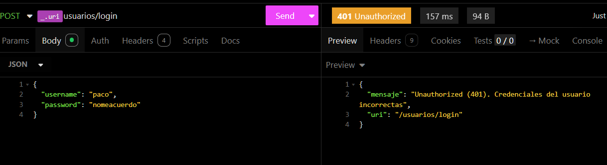
    - ⚠️ Prueba con un usuario inexistente.

- **POST /usuarios/register**
    - ✅ Prueba con datos válidos.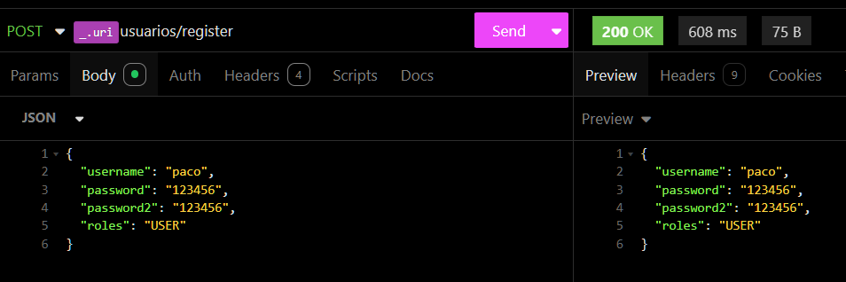
    - ❌ Prueba con username ya existente.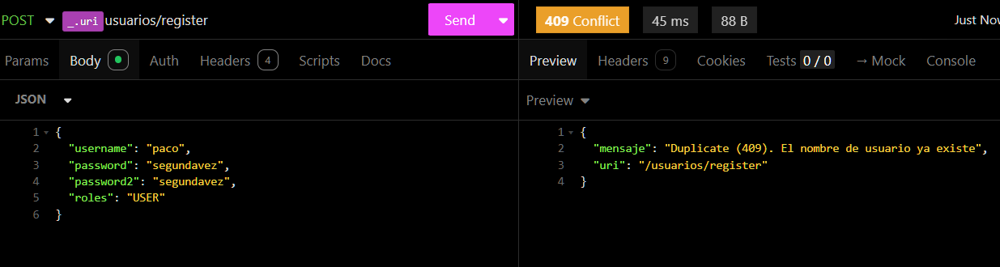
    - ❌ Prueba con password de menos de 6 caracteres.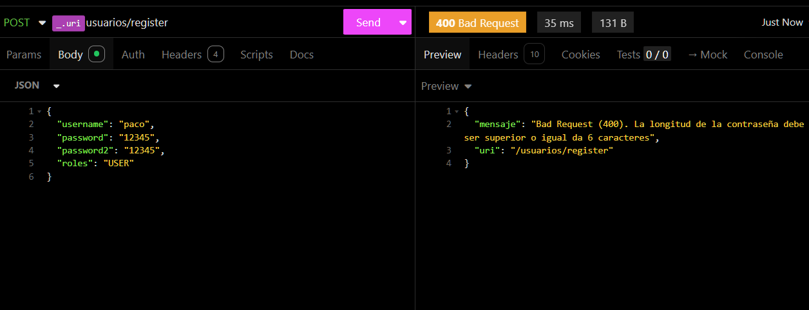
    - ❌ Prueba con password1 y password2 diferentes.
    - ❌ Prueba con un rol no permitido.

### **Gestión de Usuarios**
- **GET /usuarios/** (Solo ADMIN)
    - ✅ Prueba con usuario ADMIN.
    - ❌ Prueba con usuario USER.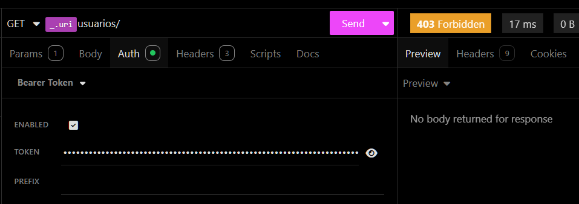
    - ❌ Prueba sin autenticación.

- **GET /usuarios/{id}** (Solo ADMIN)
    - ✅ Prueba con usuario ADMIN.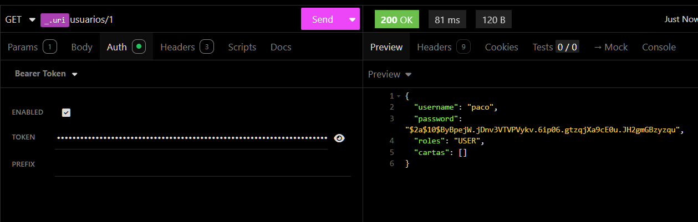
    - ❌ Prueba con usuario USER.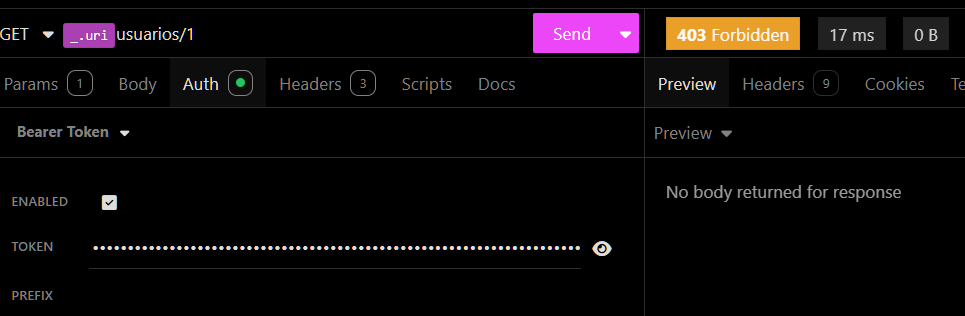
    - ❌ Prueba sin autenticación.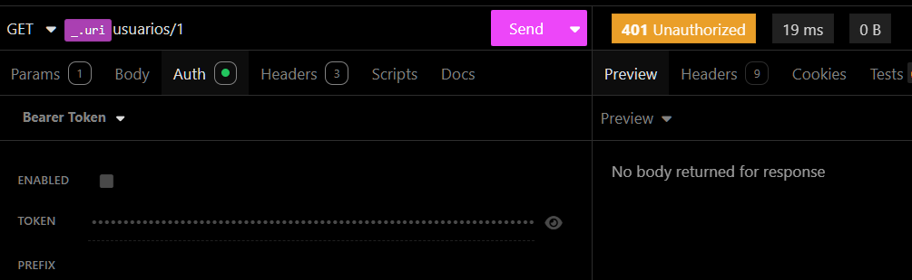
    - ⚠️ Prueba con un ID de usuario inexistente.

- **GET /usuarios/byNombre/{nombre}**
    - ✅ Prueba con usuario ADMIN.
    - ✅ Prueba con usuario dueño de la cuenta.
    - ❌ Prueba con usuario USER que intenta ver otra cuenta.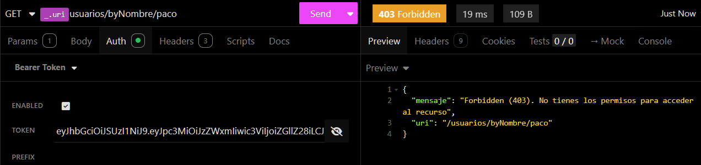
    - ❌ Prueba sin autenticación.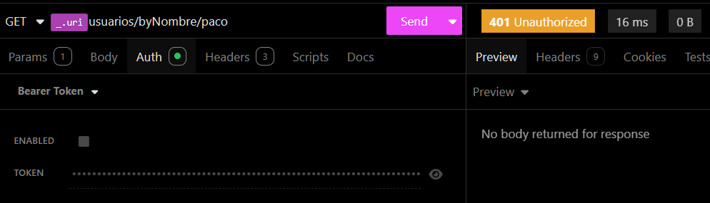

- **PUT /usuarios/{nombre}**
    - ✅ Prueba con usuario ADMIN.
    - ✅ Prueba con usuario dueño de la cuenta.
    - ❌ Prueba con usuario USER intentando modificar otra cuenta.
    - ❌ Prueba sin autenticación.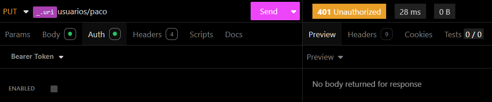
    - ❌ Prueba con un nombre de usuario inexistente.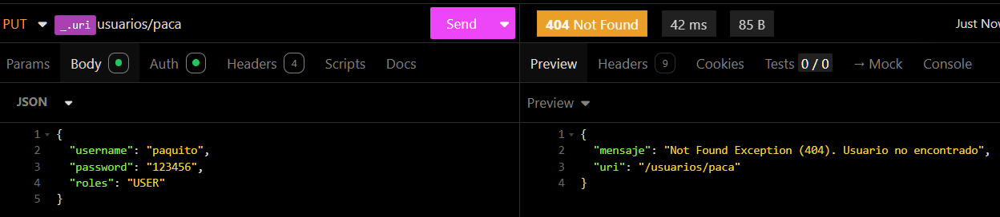

- **DELETE /usuarios/{nombre}**
    - ✅ Prueba con usuario ADMIN.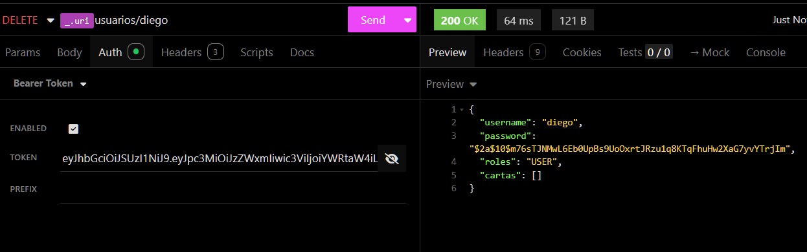
    - ✅ Prueba con usuario dueño de la cuenta.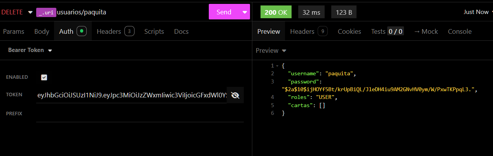
    - ❌ Prueba con usuario USER intentando eliminar otra cuenta.
    - ❌ Prueba sin autenticación.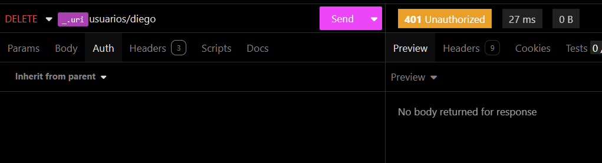
    - ❌ Prueba con un nombre de usuario inexistente.

### **Gestión de Cartas**
- **GET /cartas/** (Solo ADMIN)
    - ✅ Prueba con usuario ADMIN.
    - ❌ Prueba con usuario USER.
    - ❌ Prueba sin autenticación.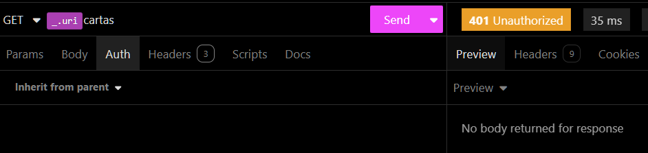

- **GET /cartas/{id}** (Solo ADMIN)
    - ✅ Prueba con usuario ADMIN.
    - ❌ Prueba con usuario USER.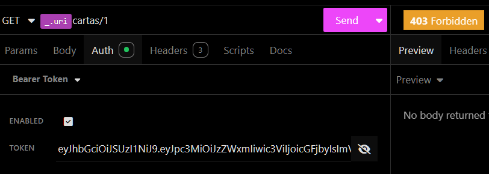
    - ❌ Prueba sin autenticación.
    - ❌ Prueba con un ID de carta inexistente.

- **POST /cartas** (Solo ADMIN)
    - ✅ Prueba con usuario ADMIN.
    - ❌ Prueba con usuario USER.
    - ❌ Prueba sin autenticación.
    - ❌ Prueba con nombre duplicado.
    - ❌ Prueba con un tipo no permitido.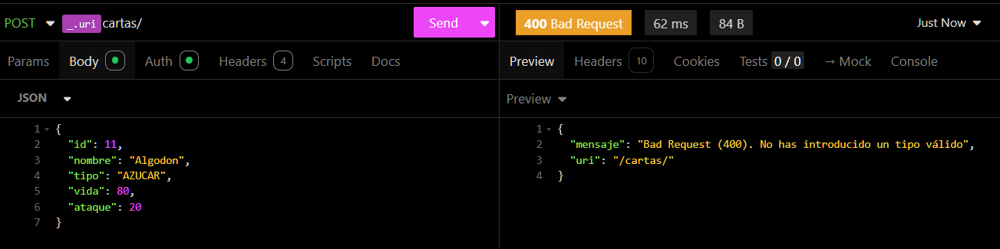
    - ❌ Prueba con vida o ataque fuera del rango permitido.
    - ❌ Prueba creando con un usuario (not null).

- **PUT /cartas/{id}** (Solo ADMIN)
    - ✅ Prueba con usuario ADMIN.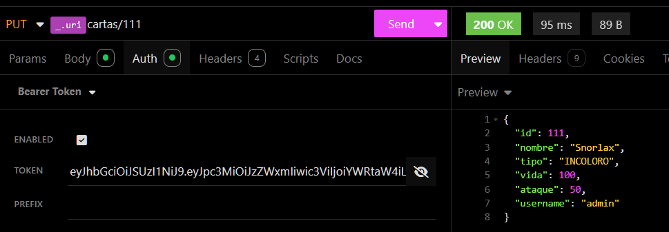
    - ❌ Prueba con usuario USER.
    - ❌ Prueba sin autenticación.
    - ❌ Prueba con ID inexistente.
    - ❌ Prueba con datos inválidos.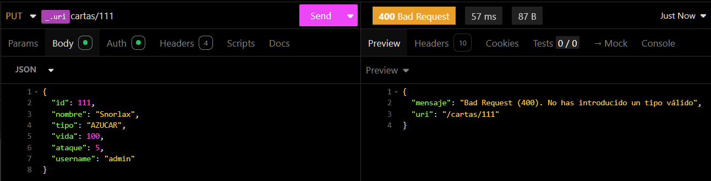

- **DELETE /cartas/{id}** (Solo ADMIN)
    - ✅ Prueba con usuario ADMIN.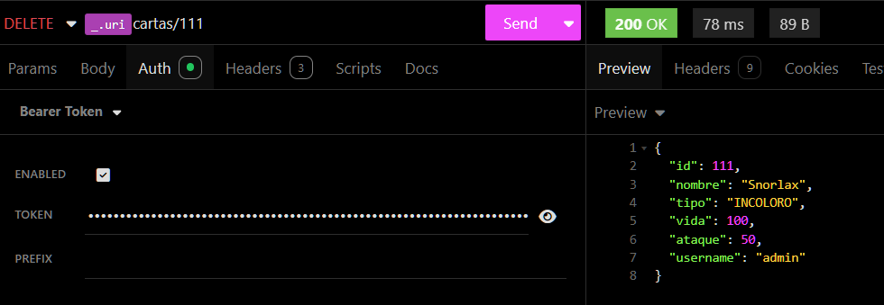
    - ❌ Prueba con usuario USER.
    - ❌ Prueba sin autenticación.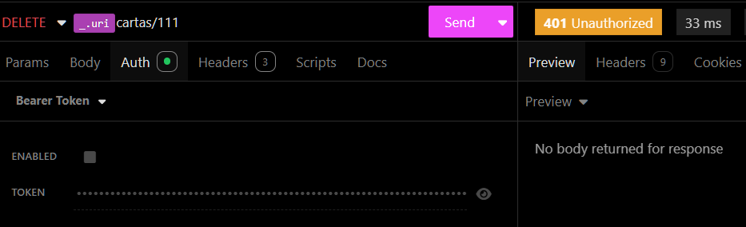
    - ❌ Prueba con ID inexistente.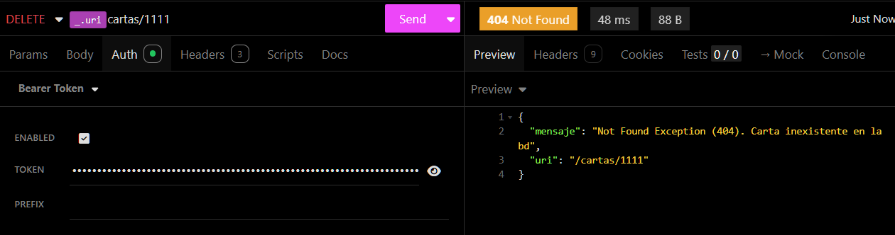

### **Gestión de Transacciones**
- **GET /transacciones/{id}** (Solo ADMIN)
    - ✅ Prueba con usuario ADMIN.
    - ❌ Prueba con usuario USER.
    - ❌ Prueba sin autenticación.
    - ❌ Prueba con ID inexistente.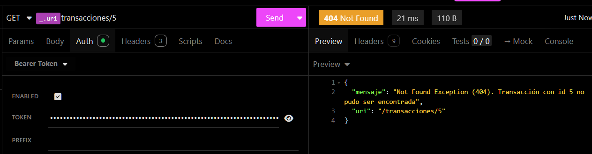

- **POST /transacciones/** (Solo ADMIN)
    - ✅ Prueba con usuario ADMIN.
    - ❌ Prueba con usuario USER.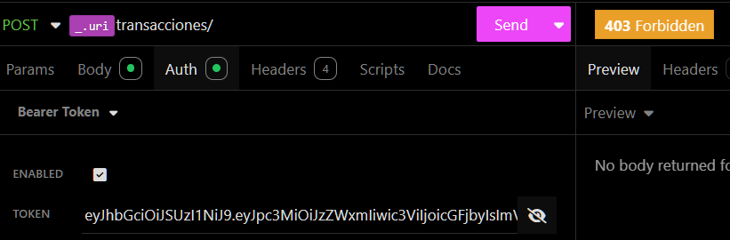
    - ❌ Prueba sin autenticación.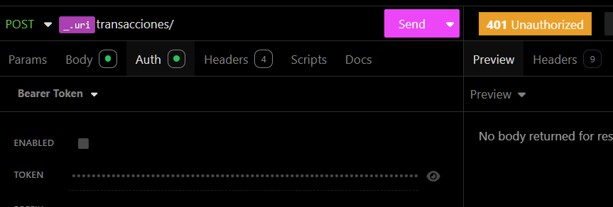
    - ❌ Prueba con ID de comprador/vendedor inexistente.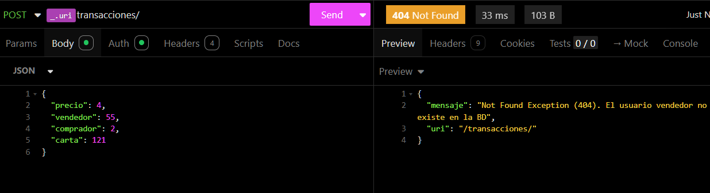
    - ❌ Prueba con ID de carta inexistente.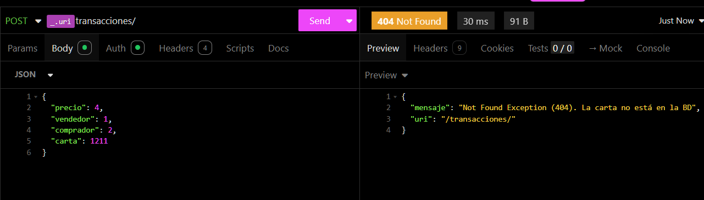
    - ❌ Prueba donde el vendedor es el mismo que el comprador.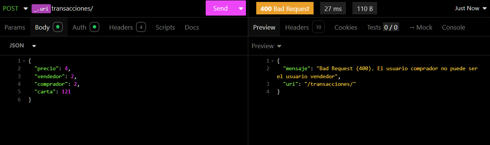
    - ❌ Prueba con precio <= 0.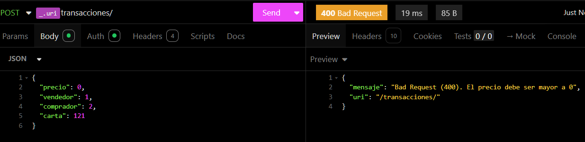

- **PUT /transacciones/{id}** (Solo ADMIN)
    - ✅ Prueba con usuario ADMIN.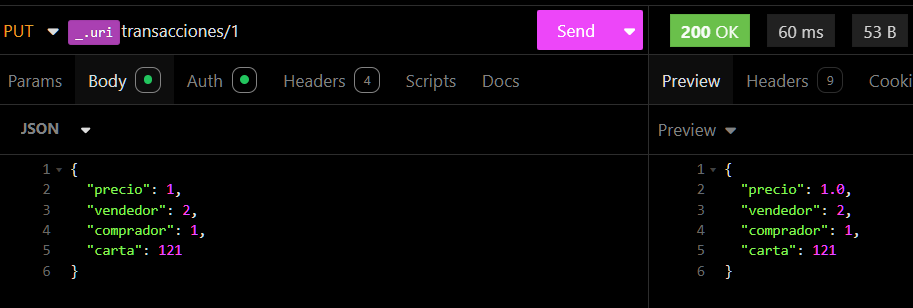
    - ❌ Prueba con usuario USER.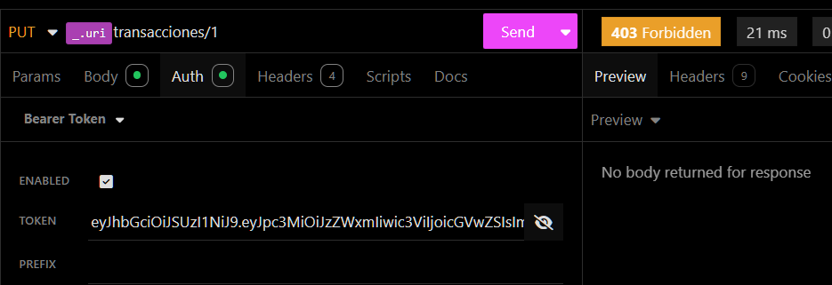
    - ❌ Prueba sin autenticación.
    - ❌ Prueba con ID inexistente.

- **DELETE /transacciones/{id}** (Solo ADMIN)
    - ✅ Prueba con usuario ADMIN.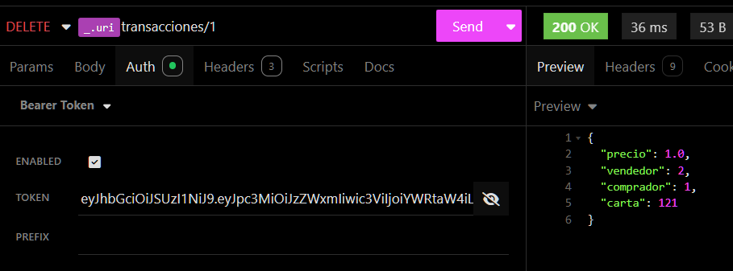
    - ❌ Prueba con usuario USER.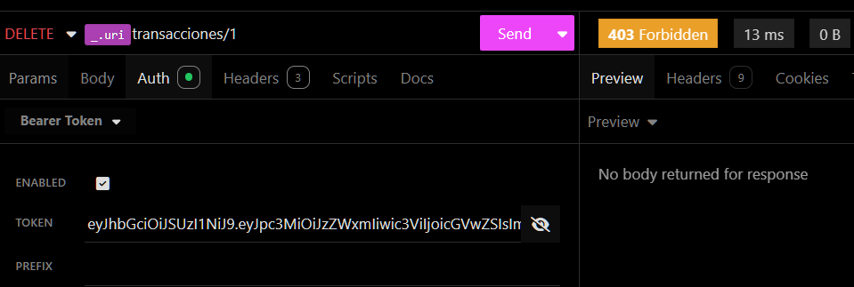
    - ❌ Prueba sin autenticación.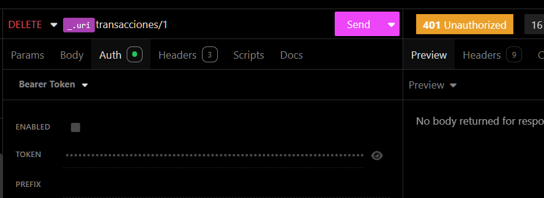
    - ❌ Prueba con ID inexistente.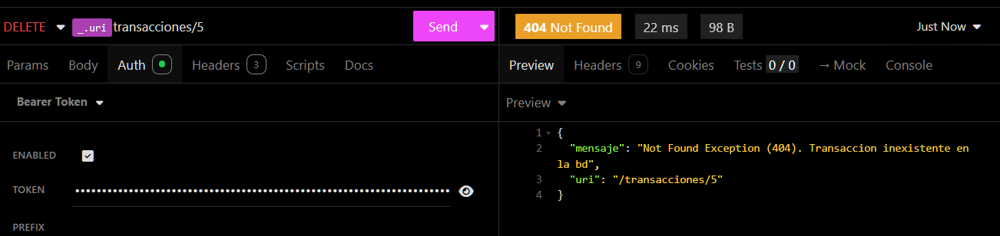

---

## **Pruebas de Seguridad**

1. **Autenticación y Autorización:**
    - Probar acceso a rutas protegidas sin autenticación.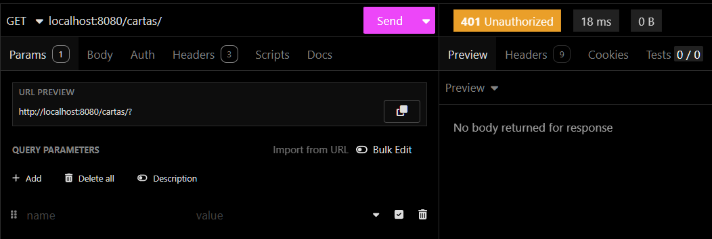
    - Intentar acceso a recursos de otros usuarios. // ver pruebas de endpoints
    - Verificar que los tokens expiran correctamente. // comprobado (por tiempo)
    - Intentar autenticarse con contraseñas incorrectas múltiples veces. // no quiero banearme

2. **Inyección SQL:**
    - Probar inyección SQL en todos los campos de entrada. // no soy hacker
    - Intentar modificar consultas mediante inputs maliciosos. // no soy hacker

3. **Cross-Site Scripting (XSS):**
    - Intentar inyectar código JavaScript en los campos de entrada. // no soy hacker

4. **Cross-Site Request Forgery (CSRF):**
    - Verificar si la API está protegida contra CSRF. // no soy hacker

5. **Exposición de Datos Sensibles:**
    - Comprobar que las contraseñas están correctamente hasheadas.
    - Asegurar que los tokens JWT no contienen información sensible.

6. **Rate Limiting y Protección contra Ataques de Fuerza Bruta:**
    - Verificar si hay protección contra múltiples intentos de autenticación fallidos. // no quiero banearme
    - Testear si se pueden realizar múltiples peticiones en un corto periodo de tiempo sin ser bloqueado. // no quiero banearme

7. **Validación de Datos:**
    - Asegurar que los datos enviados cumplen con las restricciones definidas en la lógica de negocio. // ver pruebas de endpoints
    - Intentar enviar datos inválidos y observar la respuesta del servidor. // ver pruebas de endpoints

---

## Tecnologías Utilizadas

### i. Dependencias Incluidas
En este proyecto, se han utilizado las siguientes dependencias para facilitar el desarrollo y mejorar la funcionalidad:

- **Spring Boot**: Framework para desarrollo de aplicaciones Java con arquitectura MVC.
- **Spring Data JPA**: Simplifica la interacción con bases de datos mediante JPA (Hibernate).
- **Spring Security**: Implementa autenticación y autorización en la aplicación.
- **MySQL Connector**: Permite la conexión entre la aplicación y la base de datos MySQL.

### ii. Software Utilizado
Durante el desarrollo del proyecto, se ha empleado el siguiente software:

- **IntelliJ IDEA**: Entorno de desarrollo integrado (IDE) para escribir y depurar código en Java.
- **Insomnia**: Herramienta para probar la API REST desarrollada en el proyecto.
- **XAMPP**: Paquete que incluye Apache y MySQL, entre otros, utilizado para la gestión de bases de datos en entornos de desarrollo.
- **Git/GitHub**: Control de versiones.
- **Navegador Web (Brave)**: Para manejar la BD desde phpMyAdmin.

### iii. Descripción de Tecnologías y su Propósito

- **Spring Boot**: Se ha utilizado para el desarrollo del backend, permitiendo la creación rápida de servicios RESTful.
- **Spring Data JPA**: Facilita la persistencia de datos y la comunicación con la base de datos MySQL.
- **Spring Security**: Se implementó para gestionar la autenticación y autorización de usuarios.
- **MySQL Connector**: Permite que la aplicación pueda conectarse y operar con la base de datos MySQL.
- **Insomnia**: Se ha usado para probar las peticiones HTTP y validar el correcto funcionamiento del backend.
- **XAMPP**: Se empleó como servidor local de base de datos durante la fase de desarrollo.
- **GitHub**: Se utilizó para el control de versiones.

## API REST y sus principios

### b. ¿Qué es una API REST?
Una **API REST** (Representational State Transfer) es un conjunto de reglas y convenciones para la comunicación entre sistemas mediante HTTP. 
Está basada en la arquitectura REST y permite la interacción entre cliente y servidor de forma estructurada y escalable.

### Principios de una API REST
1. **Cliente-Servidor**: Separación de responsabilidades entre el frontend y backend.
2. **Interfaz Uniforme**: Uso de métodos HTTP estándar (GET, POST, PUT, DELETE).
3. **Sin Estado**: Se dice que una API REST es sin estado (stateless) porque cada solicitud del cliente al servidor 
debe contener toda la información necesaria para ser procesada, sin depender de datos almacenados en sesiones del servidor..
4. **Caché**: Optimización del rendimiento mediante almacenamiento de respuestas en caché.
5. **Sistema en Capas**: La API puede tener múltiples capas como seguridad, balanceo de carga, etc.
6. **Código Bajo Demanda (Opcional)**: Permite enviar código ejecutable al cliente.

#### Identificación de los principios en la implementación
- **Cliente-Servidor**: Separación del frontend y backend.
- **Interfaz Uniforme**: Uso de endpoints con métodos HTTP bien definidos (`GET /usuarios`, `POST /usuarios`).
- **Sin Estado**: Cada solicitud contiene tokens de autenticación si es necesario.
- **Sistema en Capas**: Uso de controladores, servicios y repositorios en capas separadas.

## Ventajas de la separación entre Cliente y Servidor

### c. Beneficios de separar responsabilidades
1. **Mantenimiento y escalabilidad**: Cada parte puede evolucionar sin afectar a la otra.
2. **Reutilización**: Un mismo backend puede ser consumido por múltiples clientes (web, móvil, etc.).
3. **Seguridad**: Mejor control sobre la autenticación y autorización.
4. **Mejor rendimiento**: El servidor puede optimizar sus respuestas sin afectar la UI.
5. **Flexibilidad**: Se pueden usar diferentes tecnologías para frontend y backend.

Esta separación permite que el desarrollo sea más eficiente y organizado, facilitando la evolución del sistema sin grandes refactorizaciones.

